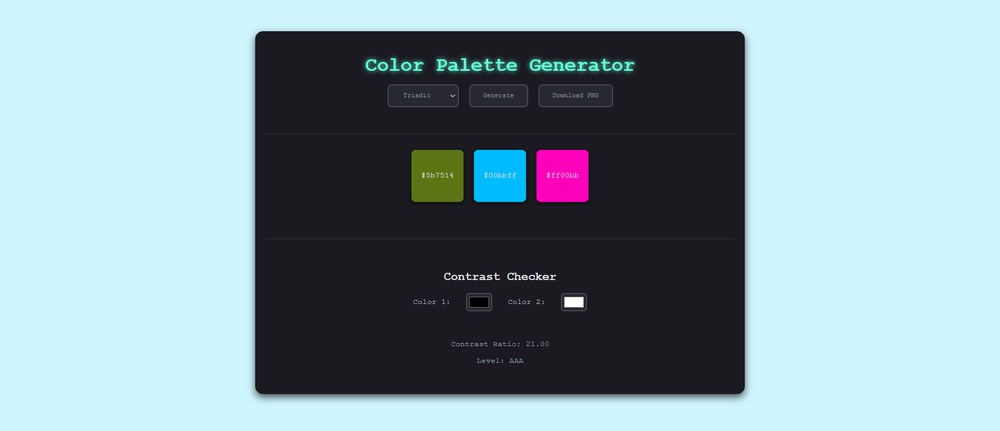

# Color Palette Generator

The **Color Palette Generator** is a web application that allows users to generate triadic and pentadic color palettes. The app also includes a contrast checker to ensure accessibility for web designs by displaying the contrast ratio and level between two selected colors. The generated color palettes can be downloaded as PNG files.

## 🖼️ Preview
  

## 🚀 Features
- **Triadic & Pentadic Color Modes**: Choose between two color schemes to generate palettes.
- **Random Color Generation**: A random base color is chosen to start the palette.
- **Color Palette Display**: Color boxes are displayed for each generated color.
- **Clipboard Copying**: Users can copy any color code to their clipboard with a click.
- **Contrast Checker**: Check the contrast ratio between two colors and display its accessibility level (AAA, AA).
- **Download Palette**: Download the generated palette as a PNG file.
  
## 🛠️ Technologies Used
- **HTML**: For the structure of the page.
- **CSS**: For styling the application with a paper notebook theme.
- **JavaScript**: For generating colors, calculating contrast ratios, and handling user interactions.
- **html2canvas**: For converting the color palette to an image (PNG format) for download.

## 📜 Instructions

  ### 1. **Opening the Application**
  - Clone the repository or download the files to your local machine.
  - Open the `index.html` file in a web browser to access the Color Palette Generator.

  ### 2. **Selecting the Color Mode**
  - At the top of the page, there is a dropdown labeled **"Mode"**. Choose one of the following modes:
  - **Triadic**: Generates a color palette of 3 colors that are evenly spaced on the color wheel.
  - **Pentadic**: Generates a palette of 5 colors evenly spaced on the color wheel.

  ### 3. **Generating the Color Palette**
  - After selecting the mode, click the **Generate** button. The application will generate a color palette with a base color and additional colors based on the selected mode.
  - The colors will appear as boxes displaying the hex code for each color.

  ### 4. **Copying a Color to Clipboard**
  - Click on any color box to copy the corresponding hex color code to your clipboard.
  - A confirmation alert will notify you that the color has been copied.

  ### 5. **Using the Contrast Checker**
  - Below the palette, you’ll find the **Contrast Checker** section:
  - **Step 1**: Use the color pickers labeled **Color 1** and **Color 2** to select two colors for the contrast check.
  - **Step 2**: The contrast ratio between the selected colors will be displayed under **Contrast Ratio**.
  - **Step 3**: The contrast level will be shown as **AA** or **AAA**, indicating the WCAG accessibility rating for the contrast.
